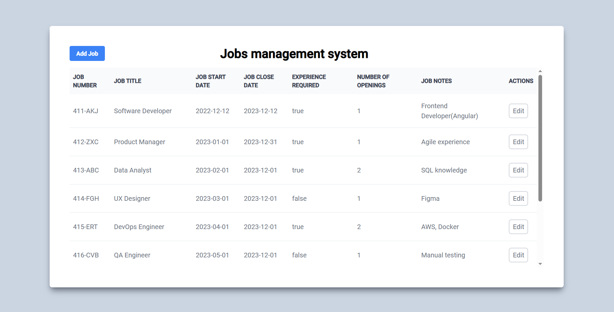

## Job Listing Application

This is a web application built with Angular, designed to display and manage job listings. It allows users to view all available jobs, add new jobs, and see detailed information about each job.

## Technologies

This project uses the following technologies:

- Angular
- TypeScript
- JSON Server
- Tailwind CSS
- Angular Material UI

## Project Structure

The application is organized into three main modules, each with its own components:

- JobDetailsModule: Displays detailed information about a specific job. Users can edit or delete the job from this view.
- JobsModule: Displays a list of all jobs in a table view.
- NewJobModule: Provides a form for users to add new jobs.

The core directory includes global services and models used across the application.

## Installation

Clone this repository.
Run npm install in the root directory of the project.
Usage
To start the development server, run ng serve and navigate to http://localhost:4200/. The application will automatically reload if you change any source files.

To start the JSON server, run npm run json:server.

## Build

To build the project, run ng build. The build artifacts will be stored in the dist/ directory.
